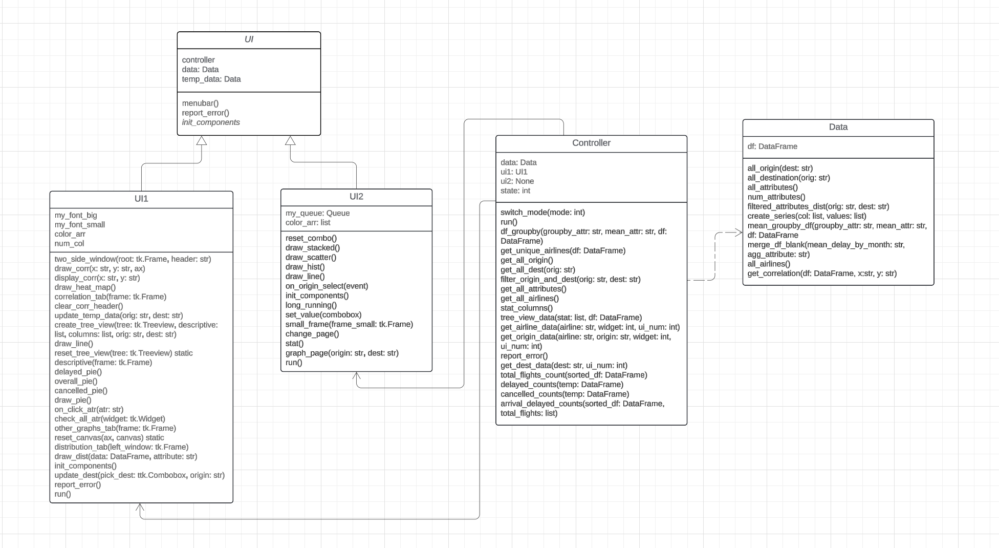

# SkyVista
## Description:
The purpose of this application is to assist users in making informed decisions about their flights and preferred airlines. 
Through the application, users can explore the relationship between variables such as month and airlines, to identify patterns in flight delays


## Data source:      
### 2015 Flight Delays and Cancellations
from Kaggle: https://www.kaggle.com/datasets/usdot/flight-delays?select=flights.csv

## Installation requirement:
## *need to use python 3.12 version
1. numpy~=1.26.4  
2. pandas~=2.2.2  
3. matplotlib~=3.9.0rc2
4. pillow~=10.3.0
5. seaborn~=0.13.2

[video demonstration](https://youtu.be/Q0uLU5h3Bag)

## Design pattern mvc pattern
## UML


## sequence diagram


## Class Describe
UI: Abstract class of UI which will be implemented later in UI1 and UI2\
UI1: Concrete implementation of UI and will have the main functionality on data exploration part of the program  
UI2: Concrete implementation of UI and will have the main functionality on storytelling part of program   
Controller: Controller part of MVC design pattern  
Data: Model part of MVC design pattern

## Repository
[Link to repository](https://github.com/yxzuz/SkyVista)

## Installation and how to run:
1. Clone the project 
```
git clone https://github.com/yxzuz/SkyVista
```
2. Change directory
```
cd SkyVista
```
3. Create a virtual environment (optional)
```
python -m venv env
```
4. Activate virtual environment
  

On MS Windows use 
```
.\env\Scripts\activate
```
On Mac use 
```
.\env\Scripts\activate
```
5. Install all requirements in requirements.txt and make sure you use python 3.12
```
pip install -r requirements.txt
```
6. Run main.py
```
python main.py
```
